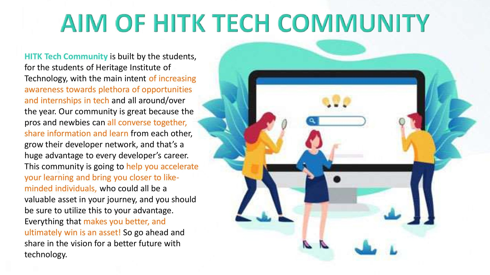
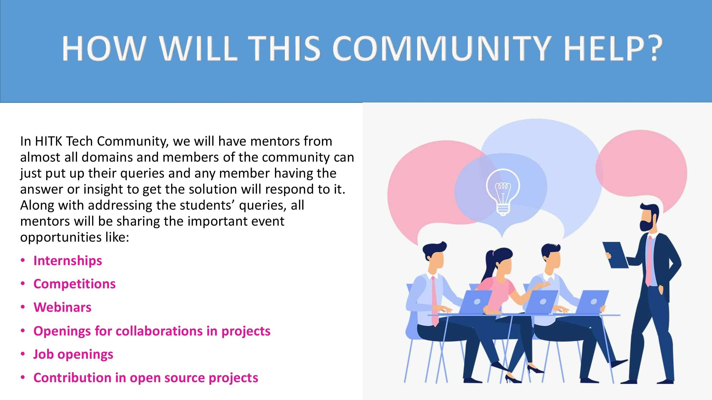
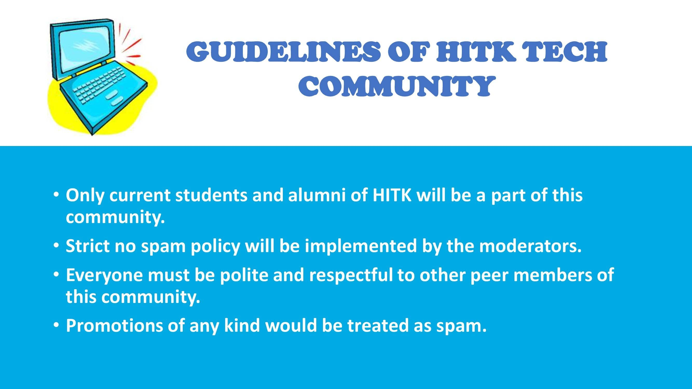

## HITK Tech Community 👩🏻‍💻👨🏻‍💻

### **Hola Tech Enthusiasts!🤩**

Once you begin walking in the path of tech, it might so happen that you discover a place where people are just like you. 😇✨

**HITK Tech Community** is a platform that helps the campus students of Heritage Institute of Technology in providing opportunities related to tech, such as:

**🔹 Internships**
**🔹 Competitions**
**🔹 Webinars**
**🔹 Openings for collaborations in projects**
**🔹 Job openings**
**🔹 Contribution in open source projects**

This will not only give practical work experience/exposure to students, but will also help the students to know and grab their required opportunities in time! And all this will be done ensuring the guidelines issued by us during community creation. This community is going to help you accelerate your learning, and bring you closer to like-minded individuals, who could all be a valuable asset in your journey, and you should be sure to utilise this to your advantage.👩🏻‍💻👨🏻‍💻

You must be curious to know more about us.😀 So, go ahead with your curiosity, read the details in the posters given below and spread the word amongst your fellow HITK students.

<kbd></kbd> 
<kbd></kbd> 
<kbd></kbd>  
<kbd></kbd> 
